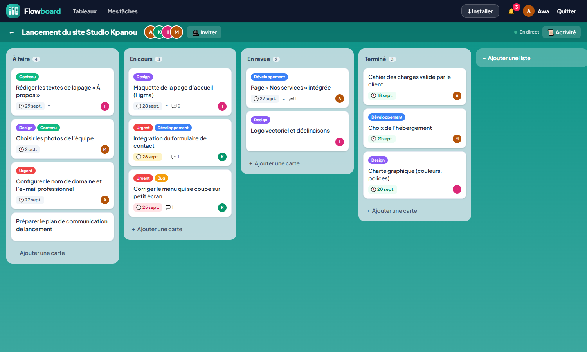
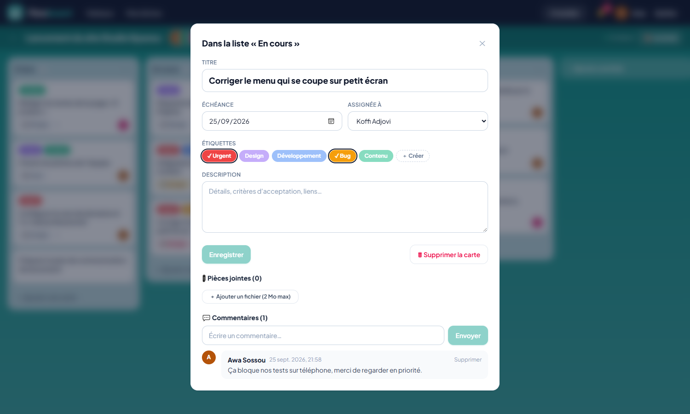
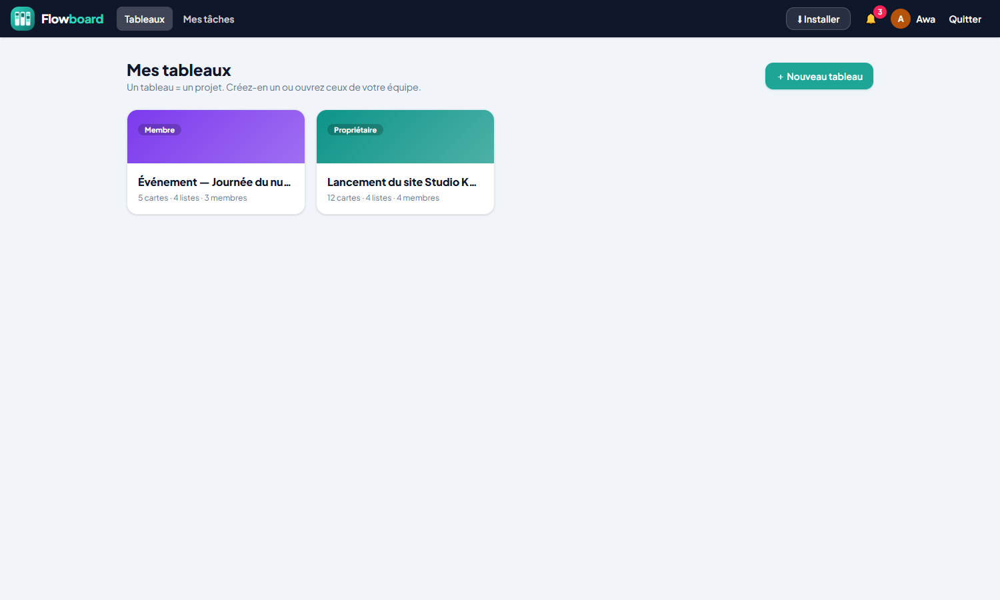
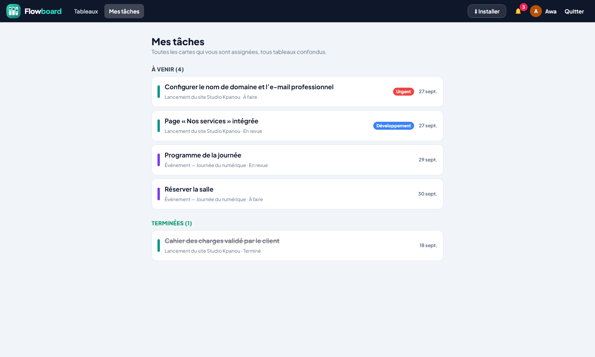

# Flowboard — Gestion de tâches d’équipe (type Trello simplifié)

Application collaborative organisée en tableaux, listes et cartes déplaçables par glisser-déposer, pour suivre l’avancement
des tâches d’une petite équipe. Projet n°9 du cahier des charges « 9 projets fictifs ».






## Fonctionnalités (MVP)

- Authentification
- **Tableaux** (un tableau = un projet) créés avec trois listes : À faire, En cours, Terminé ; listes ajoutables, renommables, réordonnables
- **Cartes** (tâches) avec titre, description, **échéance** et **étiquettes** colorées
- **Glisser-déposer** des cartes entre les listes et dans une liste (dnd-kit : souris, tactile et clavier), enregistré immédiatement
- **Invitation de membres** par e-mail : ajout direct si le compte existe, sinon invitation en attente rattachée à l’inscription

## Fonctionnalités avancées (bonus)

- **Commentaires** et **pièces jointes** sur les cartes (2 Mo maximum, types de fichiers contrôlés)
- **Notifications d’échéance** (tâche due aujourd’hui, demain ou en retard), d’assignation, de commentaire et d’invitation
- **Historique d’activité** du tableau et de chaque carte (qui a fait quoi, quand)
- Vue **« Mes tâches »** regroupant toutes les cartes assignées, tous tableaux confondus, classées par échéance
- **Mises à jour en direct** : l’interface interroge toutes les 4 secondes une « version » du tableau (requête très légère) et
  se met à jour quand un coéquipier modifie quelque chose
- Application installable (PWA), interface adaptée mobile

> **Temps réel :** le cahier des charges cite Laravel Echo + Pusher. Ce service n’est pas disponible sur un hébergement gratuit
> sans serveur WebSocket ; l’interrogation régulière offre un résultat comparable pour une petite équipe et ne demande aucune
> configuration. Le passage à Echo/Pusher ne changerait que le déclencheur du rafraîchissement.

## Sécurité

Chaque ressource (tableau, liste, carte, commentaire, fichier) est vérifiée contre l’appartenance de l’utilisateur au tableau
(un non-membre reçoit une erreur 404) ; seul le propriétaire renomme ou supprime un tableau ; l’assigné doit être membre ;
les fichiers sont stockés hors du dossier public avec un nom aléatoire et téléchargés via une route authentifiée ; le texte est
nettoyé ; limitation de débit sur l’authentification, les commentaires et les envois de fichiers.

## Stack

| Composant | Technologie |
|---|---|
| Frontend | React 19 + Vite + Tailwind CSS 4 + dnd-kit (dossier `frontend/`) |
| Backend / API | Laravel 12 + Sanctum |
| Base de données | MySQL |
| Documentation API | Collection Postman : [`docs/Flowboard.postman_collection.json`](docs/Flowboard.postman_collection.json) |

Modèle de données : `boards`, `board_membres`, `invitations`, `listes`, `cartes`, `etiquettes` (+ pivot), `commentaires`,
`fichiers`, `activites`, `notifications_app`.

## Installation

```bash
composer install
cp .env.example .env            # renseignez la base MySQL
php artisan key:generate
php artisan migrate --seed      # 2 tableaux d’équipe avec membres, cartes, commentaires et historique
php artisan serve
```

L’interface est déjà compilée dans `public/spa` (`cd frontend && npm install && npm run build` pour la modifier).
Tests : `php artisan test` (11 tests : isolation, déplacement, invitations, assignation, fichiers, rappels…).
Rappels d’échéance planifiables : `php artisan flowboard:echeances` (aussi générés à la consultation des notifications).

## Compte de démonstration

`demo@flowboard.bj` / `demo1234` (Awa Sossou) — membre de deux tableaux avec Koffi, Inès et Marc
(`koffi@flowboard.bj`, `ines@flowboard.bj`, `marc@flowboard.bj`, même mot de passe) : ouvrez deux navigateurs pour voir les mises à jour en direct.

Auteur : [Sedjame Vianney](https://sedjame-vianney.vercel.app)
